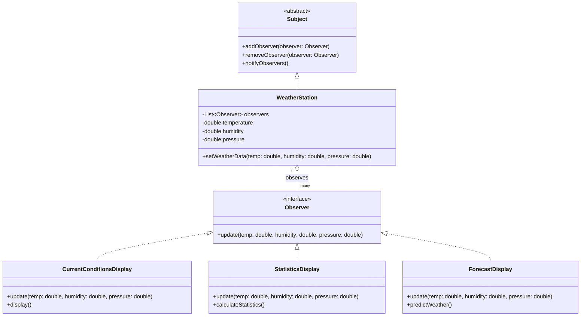

# design_patterns_dart

# **Observer Pattern:**

Define a one-to-many dependency between objects so that when one object changes state, all its dependents are notified and updated automatically.

🧩 **Concept**
The Observer Pattern allows you to create a relationship where a single object (called the Subject) can have multiple dependent objects (Observers). 
When the state of the Subject changes, all its Observers are automatically notified and updated. 
This pattern is useful in scenarios where changes in one object require automatic updates to other objects.

**🏗 Architecture Components**
1. **Subject** (WeatherStation)

Maintains a list of observers
Provides methods to:

-Add new observers

-Remove existing observers

-Notify all registered observers when its state changes

2. **Observer** (Display Interfaces)

-Defines an **update()** method

-Receives state updates from the Subject

-Can be implemented by multiple concrete classes

📚**Common Use Cases**

- Weather Applications: When weather data changes, all linked UI components (like temperature, humidity, etc.) are updated automatically.
 
- Data Synchronization: Keeping multiple views or devices in sync with a single source of truth.
 
- Notification Systems: When an event occurs, notifications are sent to all subscribers.
 

⚙️ How It Works

- **Subject**: The main object that holds the state. When its state changes, it notifies all registered Observers.
 
- **Observers**: Objects that watch the Subject. When notified, they update themselves accordingly.
 

This design pattern promotes loose coupling, making it easier to maintain and extend your code as new Observers can be added without changing the Subject.

### 📊 Class Diagram

### 🧠 **How Observer Pattern Follows SOLID Principles**

## 🟢 **1. **Single Responsibility Principle**** (SRP)

**"A class should have one and only one reason to change."**

Subject (WeatherStation) has a single responsibility: managing the weather data and notifying observers.

Observers (like CurrentConditionsDisplay, StatisticsDisplay, ForecastDisplay) have only one responsibility: to display specific information based on the updated weather data.

This clear separation of responsibilities ensures that changes in weather data logic (like how the data is retrieved) do not affect how the displays work.

## 🟢 **2. **Open/Closed Principle**** (OCP)

**"Software entities should be open for extension, but closed for modification."**

We can add new observers (like AirQualityDisplay, UVIndexDisplay) without modifying the Subject (WeatherStation).

The WeatherStation class does not need to be modified to support new displays.

New displays are simply added to the list of observers using addObserver().

## 🟢 **3. **Liskov Substitution Principle****(LSP)

**"Objects of a superclass should be replaceable with objects of its subclasses without affecting the program's correctness."**

Any class that implements the Observer interface can be substituted as an observer.

For example, CurrentConditionsDisplay can be replaced with AirQualityDisplay without any impact on WeatherStation.

This is possible because both observers implement the update() method from the Observer interface.

## 🟢 **4. **Interface Segregation Principle**** (ISP)

**"A class should not be forced to implement methods it does not use."**

The Observer interface defines only one method: update().

This ensures that all observers only need to implement the methods they require.

No unnecessary methods are imposed on the observers.

## 🟢 **5. **Dependency Inversion Principle**** (DIP)

**"Depend on abstractions, not on concrete classes."**

WeatherStation does not depend on concrete classes like CurrentConditionsDisplay.

Instead, it depends on an abstract interface (Observer), which allows for flexibility.

This makes it possible to add, modify, or remove observers without changing the Subject.
